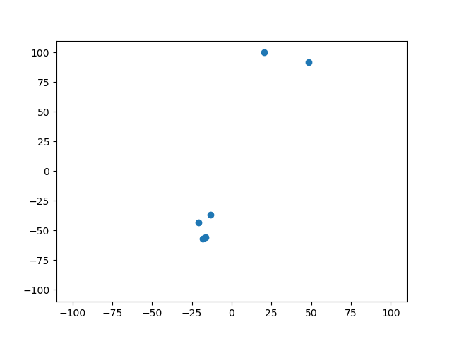

# Q-Matrix computation

The script qMatrix.py computes the Q-matrix.
This matrix contains the Q-values describing how tight two columns of a table are logically dependent.


## Command line parameters
```
qMatrix.py [--help]
           [-o=outputTable]
           [-tree] [-tree-fast] [-log] [-debug]
           [-op=outputPointList] [-oi=outputImage] [-cool-down=c]
           [-numbered] [-pandas]
           [-i=columnName]
           inputTable
```


### General

 - **--help**: shows the help of the program.

 - **-debug**: prints debug information about timing.

### Q-matrix generation

 - **-o=outputTable**: writes the Q-matrix as CSV-file. If the file name is "-" then the data will be print to stdout.

 - **-tree**: uses the tree approach instead computing the Q-matrix brute force.

 - **-tree-fast**: uses the fast version of the tree approach instead computing the Q-matrix brute force.

 - **-log**: prints debug information after computing the data.

### dependency projection

 - **-op=outputPointList**: writes the position of the projected feature points to a CSV-file. If the file name is "-" then the data will be print to stdout.

 - **-oi=outputImage**: writes the projected feature points to an image-file (PNG or PDF). If the file name is "-" then the image is shown in a window.

 - **-cool-down=c**: The coolDown value for the projection phase. Default is 0.4. The value is expected to be 0 <= c < 1. Smaller values will tend more to be a line and the probability that bijective dependent features land at the same point increases. Greater values tend more to be a cloud.


### data loader

 - **-numbered**: Use own data loader for faster table access. (default)

 - **-pandas**: Use pandas data loader for comparability.

### data input

 - **-i=columnName**: Ignores the given column during the computation. This parameter can be given multiple times.

 - **inputTable**: A file name of a CSV-file. This first line is expected to be column names.

# Examples
## Just the Q-Matrix
This example computes the Q-matrix and print it to the screen.
The algorithm is the fast brute-force version.
The column "id" is left out from the computation.

```
# python3 qMatrix.py testDataSets/test_v1.csv -o - -i id
,A,B,C,D,E,F
A,0.0,1.0,0.9758064516129032,0.9758064516129032,1.0,0.8830645161290323
B,1.0,0.0,1.0,1.0,1.0,1.0
C,0.9836065573770492,1.0,0.0,0.0,0.0,0.25
D,0.9836065573770492,1.0,0.0,0.0,0.0,0.25
E,1.0,1.0,0.25,0.25,0.0,0.5
F,0.9049180327868852,1.0,0.1,0.1,0.2,0.0
```

This example computes the Q-matrix and save it to the file "matrix.csv".
The algorithm is the fast brute-force version.
The columns "id" and "age" are left out from the computation.

```
# python3 qMatrix.py testDataSets/test_v1.csv -o matrix.csv -i id -i age
```

This example computes the Q-matrix and save it to the file "matrix.csv".
The algorithm is the fast tree version.
The column "id" is left out from the computation.

```
# python3 qMatrix.py testDataSets/test_v1.csv -o matrix.csv --tree-fast -i id
```

## Print the points for the projection of the features
```
python3 qMatrix.py testDataSets/test_v1.csv -op - -i id
Column,X,Y
A,20.28853139833481,100.0
B,48.45792848941839,92.1896196150091
C,-16.444308696504233,-55.667334519007234
D,-18.008026533532206,-56.835466609856915
E,-13.47934890341194,-36.71677738655
F,-20.814775754304826,-42.97004109959493
```

## Show the points for the projection of the features as image
```
python3 qMatrix.py testDataSets/test_v1.csv -oi images/example.png -i id
```



# Bibliography
[1] C. Umesh, K. Schultz, et al: Preserving logical and functional dependencies in synthetic tabular data in Pattern Recognition https://doi.org/10.1016/j.patcog.2025.111459

